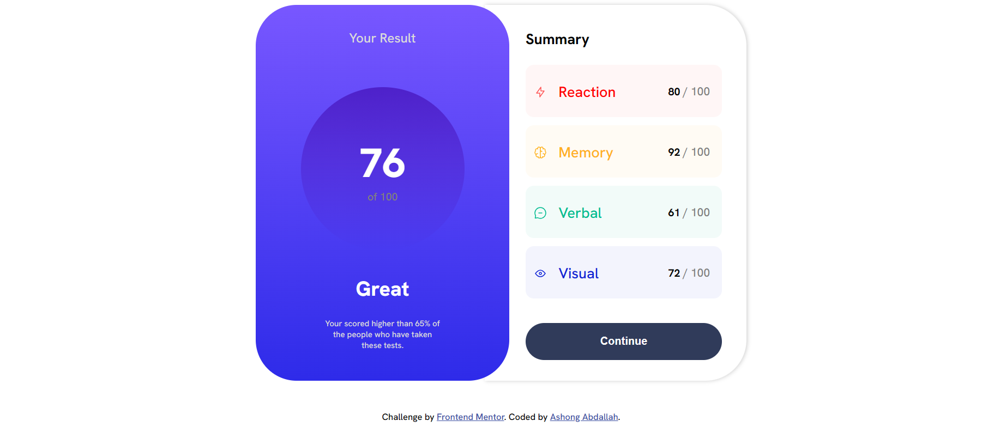
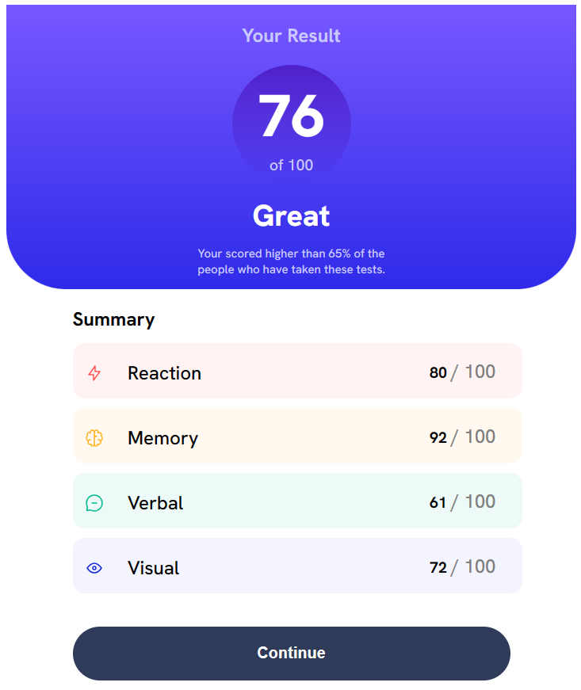

# Frontend Mentor - Results summary component solution

## Table of contents

- [Overview](#overview)
  - [The challenge](#the-challenge)
  - [Screenshot](#screenshot)
  - [Links](#links)
- [My process](#my-process)
  - [Built with](#built-with)
  - [What I learned](#what-i-learned)
  - [Continued development](#continued-development)
  - [Useful resources](#useful-resources)
- [Author](#author)
- [Acknowledgments](#acknowledgments)


## Overview

### SCREENSHOTS
**Desktop Design**
- 

**Mobile Design**
- 

### Links

- Solution URL: [https://www.frontendmentor.io/solutions/results-summary-component-GIZz3QVAiq]
- Live Site URL: [https://main-results-summary-component.netlify.app]


## My process
I created the desktop design first and then went on to create the mobile design. I had some difficulties at first but i had some help from friends and i was eventually able to do it. Created using HTML, CSS and JavaScript only.
### Steps:
  **1. Generate the HTML using JavaScript**
    **2. Style the generating HTML using CSS only** 

### Built with

- HTML
- CSS
- Flexbox
- Mobile-first workflow

### What I learned
What i learned: When creating a responsive website for all devices create the mobile design first and the modify the changes to a dektop view[P.S not necessarily important to create mobile design first.I just think it's easier that way] 

```js
const proudOfThisFunc = @media (max-width: ) {}
```


### Continued development
Improve on my overall coding experience
My focus is on improving on creating responsiveness using **media query**.


### Useful resources

- (https://www.frontendmentor.io/profile/Everezze) - Not a site of course. But this person really helped me a lot. Feel free to check out his work.

## Author

<!-- - Website - [Add your name here](https://www.your-site.com) -->
- Frontend Mentor - [@AshongAbdallah06](https://www.frontendmentor.io/profile/AshongAbdallah06)
- Twitter - [@XuGaR_2_0_0_6](https://www.twitter.com/XuGaR_2_0_0_6)


## Acknowledgments
Again Thanks to this person **@Everezze**. Profile link (https://www.frontendmentor.io/profile/Everezze). Check it out.